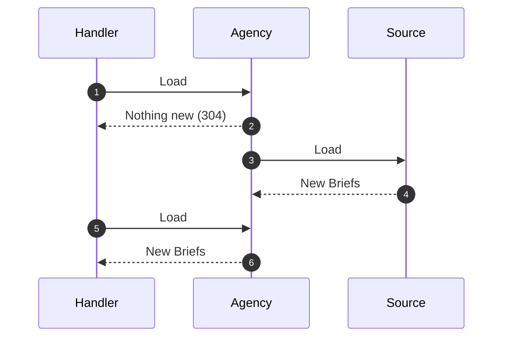
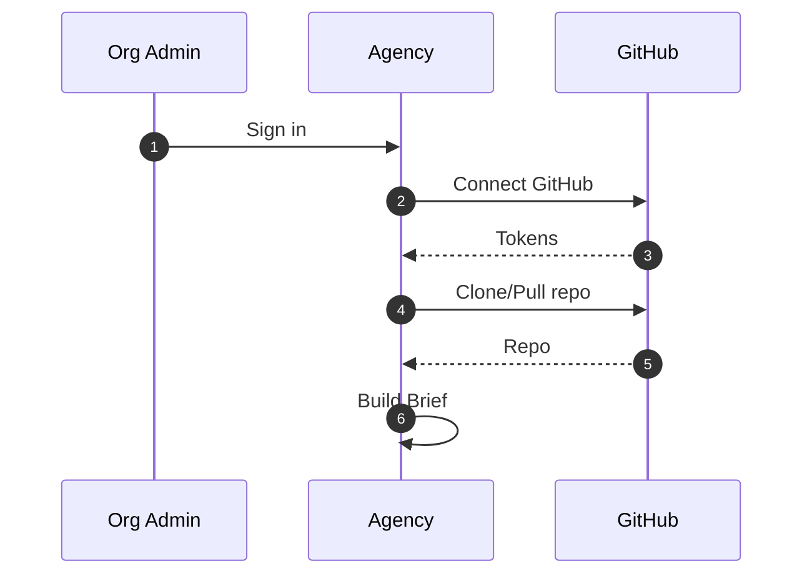

# Idea

The core idea of this project is to simplify things that suck when using agents.

## Brand

The brand is about spies. Agents in the field. The directives and orders they are given. How to manage an army of agents across the globe, across large development teams, with ease.

## The Story

Agent development is easy, until you want to control everything. You want well defined rules, skills, coding standards, project layout, frameworks, libraries, and every aspect of the code you can control.

Your agents are off on missions in the field, casually carrying out orders however they see fit.

But you need them to be organized and run the mission the way you want.

You need "The Agency" to manage all your agents.

## The Goal

To start, you need to control the Briefs all your agents receive. A single Brief can be given to multiple agents, but the Brief itself doesn't change. Everything needs to come from "The Agency" and be controlled at every level.

A Brief will contain instructions, information, rules to follow, directives, and everything the agent needs to complete their mission.

## Lexicon

* Agent - an agent that goes on missions and performs tasks
  * _the LLMs such as Claude, Codex, Kimi, etc. running on a developers machine_
  * _Agents go on missions for Organizations_
* The Agency - the central location that manages everything
  * _our webapp that might run locally or as a SaaS_
* Handler - the conduit between The Agency and Locations and Agents
  * _the daemon that runs on the developer's machine_
  * _A Handler might be working for multiple Organizations_
* Brief - the collection of files a Handler stores, for each Organization it works for, in a Location for the Agents
  * _all the files that go in the project directory_
  * _one Brief for each Organization (to start off let's keep things simple)_
* Organization - the entity that authors Briefs and controls how they are distributed
  * _a company with developers that stores their files in The Agency webapp and manages developers and teams_
* Team - a group of developers for an Organization (Organization → Team → developer)
  * _a group of developers that all have the Handler daemon running on their machines (i.e. the data team or API team)_
* Location - a location that an Agent runs a mission
  * _a directory on a developers machine_
* Mission - a project or task that an Agent undertakes
  * _a session with the LLM that might be for a specific project (i.e. adding a feature to a webapp or an API)_

## The Agency

The Agency is the central location that stores, manages, translates, and feeds the Handlers Briefs and knows nothing about Locations, Agents, or Missions.

## Handler

A Handler is the conduit between The Agency and an Agent. One developer on one machine runs one Handler. If the Agent or developer ever misplaces, destroys, or modifies a Brief, the Handler will happily give them a new copy of it from its original version.

The Handler runs on a schedule and performs 2 separate tasks, whose scheduled intervals can vary, and they can run concurrently. The first task is to call The Agency to get new Briefings (receive Briefs), which must happen atomically so that the other task only sees new Briefs the next time it runs. The second task is to copy the latest Briefs out to Locations. 

# Architecture

We could point the Handler at a local Git clone to distribute the Briefs. This would work for simple projects without any need for central control.

A more comprehensive solution is to use a central management application called The Agency.

We need to decide if the Handler should be able to be in "simple" mode or if The Agency is always required.

## Data Flow



## Brief

A Brief is a collection of everything an Agent needs to perform their missions. The data that is inside a Brief includes instructions, skills, commands, rules, assets, cover stories (so an agent can behave like another agent), masks (so an agent can look like another agent), etc.

A Handler distributes a Brief to the Agents by dropping them at each Location. Neither the Handler nor the Agent are expected to translate, decode, decrypt, or modify Briefs. They receive exactly what they need.

For example, let's say a Handler works with Claude and Codex at 5 different Locations for 2 Organizations. The Agency delivers the Briefs to the Handler, which it can make available to the 5 Locations. The API response might look something like this:

```json
{
  "briefs": [
    {
      "checksum": "...",
      "organization": {
        "id": "42",
        "name": "FusionAuth"
      },
      "version": 73,
      "files": [
        {
          "path": ".claude/rules/foo.md",
          "encoding": "text",
          "mode": "r--------",
          "content": "For Claude",
          "checksum": "...",
          "missionTypes": ["Web", "Library"]
        },
        {
          "path": ".codex/skills/bar.md",
          "encoding": "text",
          "mode": "r--------",
          "content": "For Codex",
          "checksum": "...",
          "missionTypes": []
        }
      ]
    }
  ]
}
```

The root JSON object is an array of Briefs. Each Brief contains files for the Agent to read along with the Organization it belongs to and the version. Files are managed by encoding types in the JSON. Binary files such as images are transmitted as Base 64 encoded Strings and the encoding is used to convert the Base 64 encoded String to binary.

The initial encodings are simply:

* 'text'
* 'base64'

Text is written out as the UTF-8 since that is the standard encoding for JSON strings. Base 64 is decoded to bytes that are written directly to the file.

The `mode` for each file is used to set the mode after the file is written to the store. It is the symbolic form — nine `rwx-` characters in `ls -l` order — not octal. If the mode doesn't exist in the JSON, it defaults to `r--------` to make the file read-only.

The checksums are always SHA256 everywhere.

The Handler takes this response and ensures the Briefs are available in the Location of a Mission (i.e. a project directory). This ensures that new Locations will receive the Briefs as well. Additionally, each Location should be ready for an Agent and a Mission whenever they happen.

The Handler will store the Briefs on the developer's machine. For example, a Brief might be written out to `~/.local/share/the-agency-hq/briefs/42/73/` based on the Organization id and the version number. Only the JSON response itself is stored. The files in the response are not written out separately. No previous versions are EVER pruned from this directory.

If the Handler crashes, it can be restarted, and it will check the store first and then call the API to check for updates.

A Brief will contain various files and directories that need to be added to a Location. Here's a possible solution to this problem:

1. Load the `.handler-manifest` file if it exists. If it doesn't exist, create it and add a line to `.gitignore` for this file, if it doesn't already exist.
2. Run the preflight check to ensure that the update should run.
   1. In memory, build a representation of everything that needs to be applied to this Location based on the latest Brief version and the `agent-location.json` file. This might produce an empty Brief (for example, when a user is removed from an Organization), which means an existing Brief in the Location will be deleted by following these steps.
   2. Check is to see if there are any local files that conflict with the in memory representation that are not listed in the `.handler-manifest` file. If there are conflicts, write an error to the logs and fail the update.
   3. Check is to see if any updates need to be applied by comparing the `.handler-manifest` to the in memory representation. The manifest and the in memory representation should have the same files and directories. If these differ, updates need to be applied.
   4. If the manifest and the in memory representation match, check each file in the in memory representation with the Location to see if the files differ (size differs → changed; modes differ → changed; bytes differ → changed; otherwise, same. mtime plays no part).
   5. If the update needs to be applied, continue. 
   6. Otherwise, skip the update.
3. Iterate over every Path in the `.handler-manifest` file, in reverse order, including files and directories.
   1. For each Path, remove the corresponding entry from the `Git exclude` file, if the project is a Git repository, the `Git exclude` file exists, and the file contains that entry.
   2. Since the reverse order always has files in a directory tree first, delete the file if it exists. Read-only flags should be cleared before deleting.
   3. Delete directories if they exist and are empty. Read-only flags should be cleared before deleting.
4. Clear the `.handler-manifest` file.
5. For each file in the Brief, copy them over using this workflow:
   1. Handle the directories of the file:
      1. Check if each of the sub-directories of the file (from the JSON in the Handler's store's perspective) exists in the Location.
      2. For nested files, there might be multiple sub-directories to check.
      3. For each sub-directory, in breadth-first order, check if the directory exists.
      4. If it does, ensure it is not read-only (flipping this flag if it is), and then proceed to the next directory (if any).
      5. If it doesn't, write the directory to `.handler-manifest` and create the directory with mode `0700`.
   2. Handle the file:
      1. Write the file to `.handler-manifest`.
      2. Add the file to the `Git exclude` file, if the project is a Git repository, and creating the file if it doesn't exist.
      3. Copy the file from the JSON in the Handler's store to the Location, with the same mode it has in the JSON file in the Handler's store.

Notes:

* All writes to the `.handler-manifest` file must be immediately flushed to disk.
* The location of the exclude file should be determined by running: `git rev-parse --git-path info/exclude`.

A manifest file might look like this (the first line is the SemVer version of the format of the manifest file):

```text
0.1.0
.claude/
.claude/skills/
.claude/skills/skill1/
.claude/skills/skill1/SKILL.md
.claude/skills/skill1/scripts/
.claude/skills/skill1/scripts/foo.sh
```

## Brief Versions

When a Brief changes at The Agency (either from the source, any translator changes, any modifications by Organization admins, etc), the version is incremented. The Agency manages the version number in its database and increments whenever required. The Git repository that backs a Brief uses the `main` branch and always performs a `pull` to check for changes. The Agency can use commit hashes and the GitHub API to check for changes and pull in new versions as needed.

Therefore, the version number can be a simple integer.

## API

The Handler needs a way to sync with The Agency. This is done using a secure, versioned communication line. The Handler calls The Agency to see if it has any updates for any Briefs. If The Agency has any updates, it will respond with the updates.

Since The Agency might be working with multiple Handlers, it needs a way to identify the Handler.

The API might look something like this:

```http request
POST /api/v1/briefing
Authorization: Bearer <The-Handler's-Token>

{
  "currentVersions": [
    { "organizationId": "42", "version": 73, "checksum": "..." },
    { "organizationId": "43", "version": 9283, "checksum": "..." }
  ]
}
```

The Handler's Token contains the Handler's user id (i.e. the developer's user id).

The Agency will receive this request and check if the Brief has a version newer than `73` for the `42` Organization and a Brief newer than `9283` for the `43` Organization. The user might belong to multiple organizations, in which case, each Organization's Brief will be checked.

The Briefs are also checked for integrity using the checksum provided. This checksum is based on the full JSON response from the original response the Handler received. This is the file that is stored in the Handler's store. The Handler will SHA256 checksum the JSON file in the store and send the checksum along with the request.

If there are any updates, those are always returned.

If any of the checksums don't match, The Agency will also return the latest version of the corrupt Brief in the response.

The Handler will always overwrite it's local JSON files based on the response from The Agency.

However, if there are no updates and all the checksums match across every Organization, The Agency will respond with a 304 status code.

To ensure checksums are computed the same every time, The Agency should store the JSON response for each version in the database along with the checksum. This makes it simple to check versions and checksums before sending back the entire response.

Additionally, this API needs to be capable of signaling back to the Handler that a user no long has permissions to an Organization. This is left as an implementation detail, but is in scope. 

## Organizations

The Agency is a worldwide entity that works with multiple Organizations who are running multiple Agents in the field at all times. An Organization will have one or more admins who are responsible for building the Briefs for their Agents. These Briefs are given to The Agency, and The Agency distributes them to the Handlers.

Organizations are not case-sensitive and must be unique. Registering an Organization name is first-come-first-serve, just like NPM, Latte, Docker, etc.

## Locations

A Location is a place where an Agent is on a Mission for an Organization. This is a directory on the developers machine where the Agent is running. The Handler determines the Location of a Mission by traversing from a starting point on the developer's machine and finding Locations that contain a special marker.

The starting point defaults to `~/`, but is configurable via an environment variable or in the Handler's config file located at `~/.config/the-agency-hq/handler.json`. This configuration file also includes a list of directories not to traverse, which can include wildcards. Here's an example initial version of this file:

```json
{
  "startDirectory": "~",
  "excludeDirectories": [
    "build",
    "node_modules",
    "output",
    ".*"
  ],
  "theAgencyURL": "http://localhost:8080",
  "accessToken": "",
  "refreshToken": ""
}
```

The marker is a file named:

```bash
agent-location.json
```

This file is a JSON file that contains information about the Location the Handler needs to know in order to deliver a Brief. The two required parameters of this file are the Organization id and the version. Additional parameters instruct the Handler how to treat this Location. For example, this Location might only run `Library` Missions. Therefore, the Organization might have specified the Mission Types that are run from this Location and all others will be ignored (i.e. Briefs that are `Web` related would be ignored):

```json
{
  "version": "1.0.0",
  "organizationId": "42",
  "missionTypes": ["Library"]
}
```

The Location marker file is source-controlled and shared so that new developers that arrive at a Location will be able to run their Agents successfully there with no effort.

## Teams

Developers might be organized into Teams within an Organization. A developer might belong to multiple Teams. Teams are stored by The Agency and defined by the Organization. Developers can be added and removed from Teams.

## Mission Types

Briefs will contain files that don't always apply to specific Locations or Missions. A Location can filter files itself, but only if the Organization specifies the types of Missions a file applies to. These are called Mission Types and are simple strings akin to tags. They are free form text entries on a file and free form text entries in a Location file.

Mission Types are not case-sensitive.

Here's a truth table for Mission Types (dash indicates no Mission Types defined):

| File Mission Type(s) | Location Mission Type(s) | Include file? |
|----------------------|--------------------------|---------------|
| -                    | -                        | yes           |
| -                    | Web                      | yes           |
| -                    | Web, Library             | yes           |
| Web                  | -                        | yes           |
| Web                  | Web                      | yes           |
| Web                  | Web, Library             | yes           |
| Web                  | Framework                | no            |
| Web                  | Web, Framework           | yes           |
| Web, Library         | -                        | yes           |
| Web, Library         | Web                      | yes           |
| Web, Library         | Web, Library             | yes           |
| Web, Library         | Library                  | yes           |
| Web, Library         | Framework                | no            |
| Web, Library         | Framework, Web           | yes           |
| Web, Library         | Framework, Library       | yes           |

When a file from The Agency has a specific Mission Type, the Location must include that Mission Type in its list or have no list, indicating it accepts everything. Matching Mission Type lists is always an `OR` operation.

## Authoring

An Organization needs a way to author Briefs. This will initially be handled by pointing The Agency at a GitHub repository using a GitHub App. The flow looks like this:



The repository that contains the files for the Brief looks like this:

```
skills/                 # General for all Agent types
├── skill1/
│   ├── .mission-types          
│   ├── SKILL.md          
│   ├── scripts/          
│   ├── references/       
│   ├── assets/           
│   └── ...               
├── skill2/
│   ├── .mission-types          
│   ├── SKILL.md          
│   ├── SKILL.md.mission-types          
│   ├── scripts/          
│   ├── references/       
│   ├── assets/           
│   └── ...               
rules/                  # General for all Agent types but will require translation
├── rule1.md
├── rule2.md
├── rule2.md.mission-types
agents/                 # General for all Agent types but will require translation
├── agent1.md
├── agent2.md
claude/                 # Escape hatch for Claude specific items
├── commands/
│   └── ...               
├── settings.json
codex/                  # Escape hatch for Codex specific items
├── rules/
│   └── (.rule files)               
├── config.toml
the-agency-hq-settings.json     # To start this just contains the SemVer version of the layout, which starts at `1.0.0`
```

Not all Agents will understand all of these concepts, but since Claude is on the leading edge of tooling, we've leaned on their structure heavily. There is also an escape hatch that allows Agent specific files to be added to the Brief. Each Agent type has a top level folder that is the name of the Agent.

The Agency is responsible for taking the input from an Organization and creating the Brief. The result looks like this:

```
.claude/
├── skills/
│   ├── skill1          
│   │   └── ...          
│   ├── skill2          
│   │   └── ...          
├── rules/
│   ├── rule1.md          
│   └── rule2.md          
├── commands/
│   └── ...          
├── settings.json
.codex/
├── skills/
│   ├── skill1          
│   │   └── ...          
│   ├── skill2          
│   │   └── ...          
├── rules/
│   ├── (.rule files)
│   ├── rule1.md
│   └── rule2.md
├── config.toml     
```

The creation of the Brief is the tricky part. While there are tools such as Ruler, I think it's best if we write and maintain this ourselves.

We will need to figure out how to translate every concept from the source to the native method for each Agent type. Rules will be challenging since some agents have native support while others require them to be concatenated into context files such as `AGENTS.md` or `AGENT.overrides.md`. This process is out of scope of this document and will be determined later.

Similarly, versioning Briefs is something that will be handled during implementation.

Mission Types are specified at the file or directory level. If a directory contains a file named `.mission-types`, all files in that directory and sub-directories inherit the values in that file (one Mission Type per line). A file can specify different Mission Types by having a sibling file with the extension `.mission-types`. Here's an example:

```
Web
Library
```

If a directory contains no Mission Type file and no files in that directory (recursively) contain an override file, then the files apply to all Mission Types.

## In Scope

These items are in scope:

* Audit logging of everything everywhere (GRC)
* Handler authentication is done using OAuth to FusionAuth from The Agency webapp. This will cause the access and refresh tokens to be stored in the Handler configuration under `~/.config/the-agency-hq/handler.json`. The access token will be refreshed as needed using the OAuth refresh grant.
* Revoking permissions for a user. An Organization Admin can revoke a user's permissions by removing them from the Organization. Since the API uses the user id from access token to determine which Organizations the user belongs to, this has immediate effect. No need to revoke the tokens themselves if the user is removed from all Organizations. The API can also respond with a forbidden style response code and the Handler can delete everything from the developers machine if needed.
* Network issues such as The Agency being unavailable and the Handler serving the stored version of the Briefs
* Handler crashes such that the developer receives a notification or the Handler auto-restarts
* A CLI that assists developer in initializing a Location with the proper `agent-location.json` file (very likely will call an API at The Agency to get a list of Organization names and ids)

## Out of Scope

These items are out of scope currently:

* Brief approvals
* Brief states
* Brief scoping
* File states
* File scoping outside of Mission Types
* Layering (project, team, developer machine, etc)
* Enforcement strength (i.e. are files managed, seeded, etc.)
* Secret scanning unless it's simple/free
* Source control of the files in the Brief without a project directory. If the developer chooses to commit these files to the repository, that's their problem, not ours. The docs should tell them not to, but we can't help developers from blowing their legs off!
* Escape hatch layout and file name verification in the source Git repository (developers own this not The Agency)
* Fleet reporting
* Drift reporting (developers tampering with files)
* Context costs for Briefs